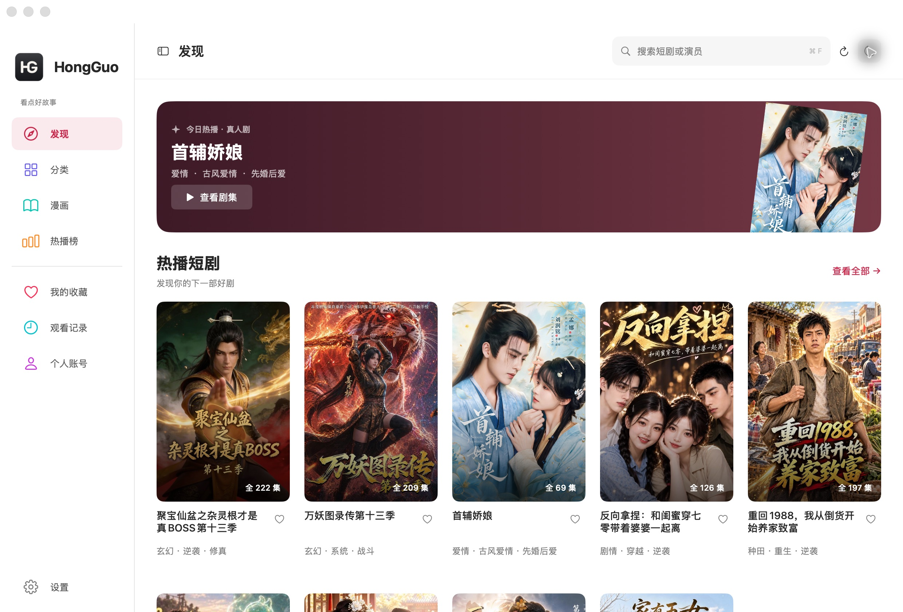
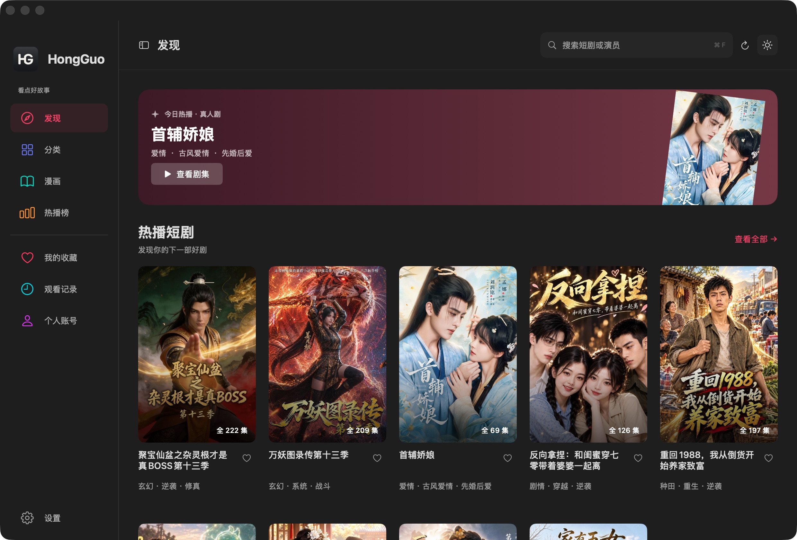
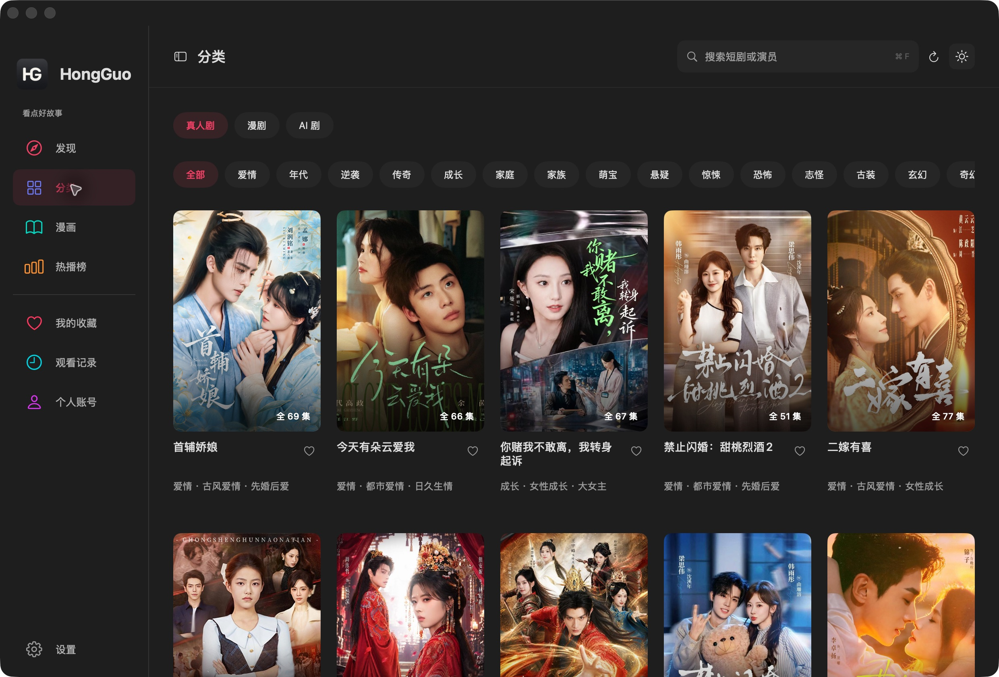
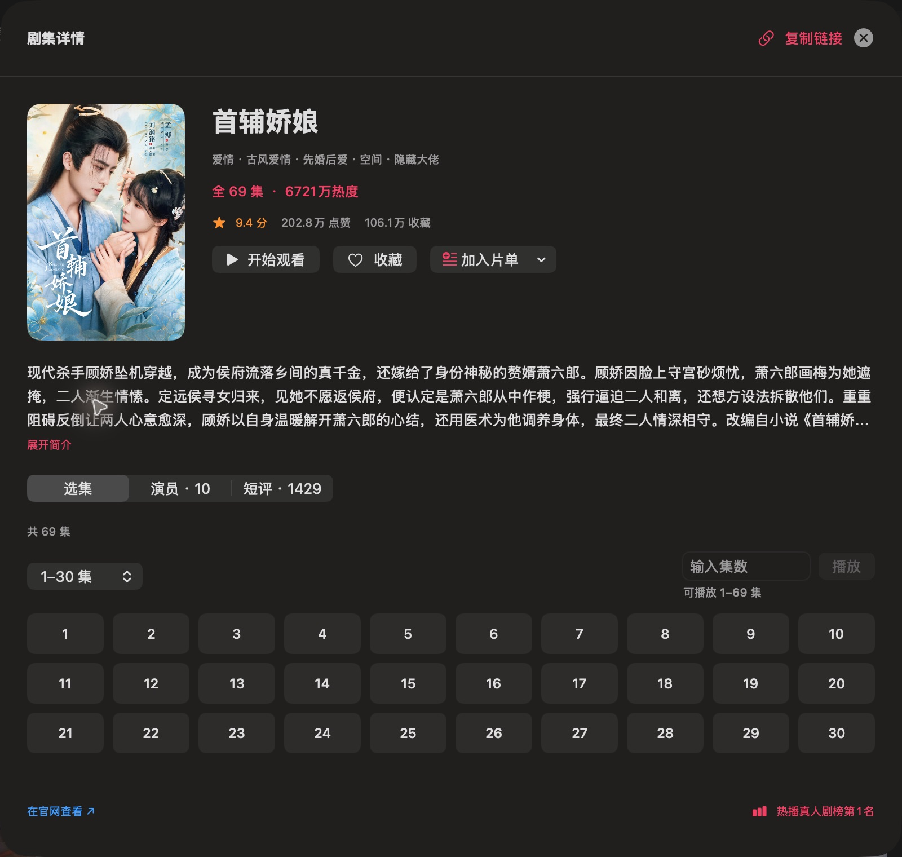
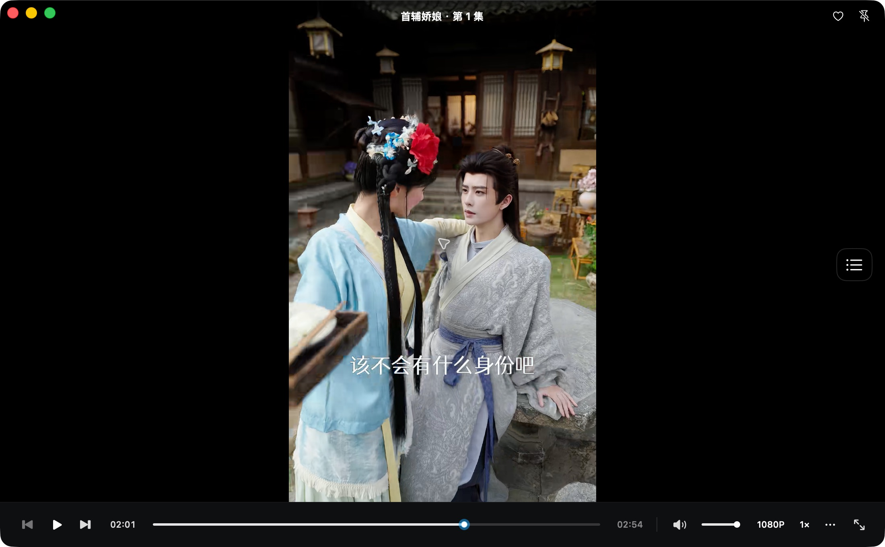

# HongGuo for macOS

一个面向 Mac 的非官方短剧客户端：浏览片单、独立窗口播放、记住观看进度，也可以自定义应用名称和图标。

**[⬇ 下载 Mac 安装包](https://github.com/junmo-zy/hongguo-mac/releases/download/v0.4.18/HongGuo-Mac-0.4.18-arm64.dmg)**　｜　[三步安装](#三步安装)　｜　[安装说明](#安装说明)　｜　[全部版本](https://github.com/junmo-zy/hongguo-mac/releases)

**macOS 14+ · Apple Silicon（M 系列）· v0.4.18 · 148.6 MiB**。点击上方直接下载 `.dmg`，无需进入 Releases 查找文件，也不用下载 `Source code` 压缩包。

> [!IMPORTANT]
> **本项目不是红果官方产品，与红果及其关联主体无隶属、合作、赞助或背书关系。** 第三方内容、封面、商标和组件归各自权利人所有。更换名称或图标不代表取得内容或服务授权；免费、非商业使用也不当然免责。下载、使用或传播前，请阅读 [免责声明与权利说明](DISCLAIMER.md)。

## 版本与系统要求

| 项目 | 说明 |
| --- | --- |
| 当前版本 | v0.4.18 |
| 系统 | macOS 14 或更新版本 |
| 芯片 | Apple Silicon，M 系列芯片；目前不支持 Intel Mac |
| 安装包 | `HongGuo-Mac-0.4.18-arm64.dmg`，约 148.6 MiB |
| 运行环境 | 已内置 Python、Java 及所需组件，无需自行配置 |
| 手机依赖 | 不需要连接手机或运行安卓模拟器 |
| 网络 | 浏览内容和播放需要联网，内容可用性由第三方服务决定 |
| 签名 | 临时签名，尚未经过 Apple 公证 |

本仓库用于分发安装包、说明和截图，不是完整源码仓库，也不在仓库中托管剧集文件。

## 界面截图

### 主界面外观

| 浅色模式 | 深色模式 |
| --- | --- |
|  |  |

主界面可在设置或右上角按钮切换外观。下方功能截图分别标注所用模式；视频播放窗口始终使用深色背景。

### 分类与筛选 · 深色模式

### 剧集详情与选集 · 深色模式

### 独立播放窗口 · 固定深色

截图用于展示客户端界面，片单、封面与画面会随内容服务变化。

## 功能一览

| 场景 | 当前支持 |
| --- | --- |
| 发现内容 | 发现页、分类、真人剧 / 漫剧 / AI 剧筛选、热播榜 |
| 搜索 | 按剧名或演员搜索、最近搜索记录、搜索结果分页 |
| 查看详情 | 剧情简介、可用演员资料与短评、剧集列表、复制链接 |
| 独立播放 | 单独播放窗口、上一集 / 下一集、自动连播、集数分组与跳转 |
| 画质 | 默认选择片源提供的最高可用清晰度，支持手动切换，切换时保留进度 |
| 播放控制 | 点击画面播放 / 暂停、拖动进度、音量 / 静音、全屏、窗口置顶、定时停止 |
| 倍速 | 0.75×、1×、1.25×、1.5×、2×；选择后自动保存 |
| 快进快退 | 方向键操作；步长可选 5、10、15、30、60 秒 |
| 播放偏好 | 倍速、音量、静音、快进步长和自动连播设置保存在本机 |
| 收藏与记录 | 我的收藏、想看 / 在看 / 已看状态、观看记录、续播、收藏筛选与排序 |
| 备份 | 收藏与记录支持 JSON 导出、导入合并 |
| 漫画 | 漫画列表、公开章节阅读、本机阅读进度 |
| 外观 | 浅色、深色、跟随系统；线框侧栏图标；主内容区细条悬浮滚动条 |
| 个性化 | 自定义名称和图标、恢复默认、生成定制 App |

播放中约 1.5 秒无操作后隐藏控制栏；暂停、加载、选集或拖动时保留操作入口。视频窗口始终使用深色背景。画中画是否可用取决于片源与 WebKit 支持。

## 三步安装

1. **下载**：[点击下载 HongGuo Mac 安装包](https://github.com/junmo-zy/hongguo-mac/releases/download/v0.4.18/HongGuo-Mac-0.4.18-arm64.dmg)。
2. **安装**：打开 `.dmg`，把 **HongGuo.app** 拖入 **Applications / 应用程序**。已有旧版时，先完全退出，再选择替换。
3. **启动**：从「应用程序」打开 **HongGuo**。

## 安装说明

当前安装包仅支持 **macOS 14+、Apple Silicon（M 系列芯片）**，不支持 Intel Mac。无需另装 Python、Java 或安卓模拟器。Release 自动生成的 `Source code` 压缩包不是 Mac 安装包。

旧版名称若仍是「红果短剧.app」，先将旧 App 改名为「HongGuo.app」再替换，避免保留两个入口。替换应用会沿用本机收藏、观看记录和播放偏好；重要数据可先在「设置 → 我的数据」导出备份。

如果 macOS 阻止打开，请先核对下载来源，再在「系统设置 → 隐私与安全性」使用系统提供的「仍要打开」入口。无需关闭系统安全防护。

## 常用操作

| 操作 | 快捷键 / 入口 |
| --- | --- |
| 搜索 | `⌘ F` |
| 播放 / 暂停 | 单击视频、空格或 `⌘ P` |
| 快退 / 快进 | `←` / `→`，也支持 `⌘ ←` / `⌘ →` |
| 增加 / 减少音量 | `↑` / `↓`，每次 5% |
| 静音 / 恢复声音 | `⇧ ⌘ M` |
| 全屏 / 退出全屏 | 播放器全屏按钮或 `⌃ ⌘ F` |
| 快进步长 | 设置 → 观看偏好，或播放器「更多」 |
| 清晰度 | 播放器底部清晰度菜单 |
| 倍速 | 播放器底部倍速菜单；设置内也可指定默认速度 |
| 选集 | 播放器右侧列表按钮，或剧集详情的选集区域 |
| 外观 | 右上角太阳 / 月亮按钮，或设置 → 外观 |
| 备份 | 设置 → 我的数据 → 导出备份 / 导入 |

方向键在播放窗口内生效；输入集数时保留正常的文字编辑行为。完整快捷操作也可在「设置 → 快捷操作」查看。

## 自定义名称与图标

打开 **设置 → 名称与图标**：

1. 输入 1–24 个字符的名称。
2. 选择 PNG、JPEG 或 ICNS 图标，文件不超过 20 MB。
3. 点击「保存」。界面名称、窗口标题和运行中的 Dock 图标立即更新，重启后仍会保留。
4. 「默认图标」可重新选用 HG 图标；「恢复默认」会恢复 HongGuo 名称及默认图标。

若需要 **Finder 和 Dock 显示的应用名称**一起改变，点击「生成定制 App…」，选择一个尚未使用的保存位置。成功后退出原 App，从新 App 启动，再将新 App 移入 Applications。定制 App 携带所选名称与图标，并沿用原来的收藏、记录与播放偏好；不会覆盖已有应用或改写正在运行的 App。

Dock 若固定了旧入口，请移除旧入口并固定新 App。安装后续发行包后，可再次生成定制 App。自定义名称或图标不会改变第三方内容的权利与许可。

## 数据与账号

收藏、观看记录、漫画进度及偏好保存在本机。备份导入会合并收藏和记录，并尽量保留较新的观看进度。

**目前尚未接入红果账号登录和手机云同步。** 「个人账号」入口不表示已经实现官方账号体系。评论发布、关注、会员和离线下载也尚未接入；详情页展示的短评为内容服务提供的可读信息。

## 常见问题

**为什么某一集播放失败或加载较慢？**

片源、网络和第三方服务的可用性会变化。可重试当前集，或尝试其他可用清晰度。默认最高画质可能需要更多带宽；本项目不承诺所有剧集始终可播。

**为什么最高画质不是固定 1080P / 4K？**

“最高”指当前片源提供的最高可用档位。不同剧集可选档位可能不同，不会把低分辨率画面标成更高画质。

**搜索内容不全怎么办？**

搜索接口不可用时会回退到官网首批结果，此时搜索范围和分页能力可能受限。可以尝试缩短关键词，或从分类与热播榜查找。

**更新后收藏会丢失吗？**

正常替换 App 会保留本机数据。更新前可先导出收藏与记录备份；若迁移到另一台 Mac，可再导入。备份不包含剧集视频或官方账号信息。

**为什么 Dock 仍显示旧名称或旧图标？**

先退出旧 App，再从新 App 启动；若 Dock 固定的是旧文件，移除旧入口后重新固定。只修改界面名称时，Finder 文件名不会跟着改变，需要使用「生成定制 App」。

**是否支持 Intel Mac、Windows 或离线观看？**

这个发行包仅面向 Apple Silicon Mac，目前不提供 Intel、Windows 或离线下载支持。

## 项目来源与反馈

Mac 界面使用 SwiftUI + WebKit。桌面播放方案参考 [hongguo-desktop-releases](https://github.com/waligoraamodio288-rgb/hongguo-desktop-releases)，后端来源为其公开发行组件及 [zhangbaio/hongguo](https://github.com/zhangbaio/hongguo)。组件来源说明与原有许可证保留在应用包的 `Contents/Resources/Backend/PROVENANCE.md`、`Backend/licenses` 及运行环境目录中。本项目不重新许可第三方组件或内容。

遇到问题请在 [Issues](https://github.com/junmo-zy/hongguo-mac/issues) 提供 macOS 版本、芯片型号、应用版本、复现步骤和错误提示。播放问题可附剧名及集数；截图请避开个人信息，无需提交密码、验证码或账号凭证。

权利人反馈与处理方式请见 [免责声明与权利说明](DISCLAIMER.md)。
